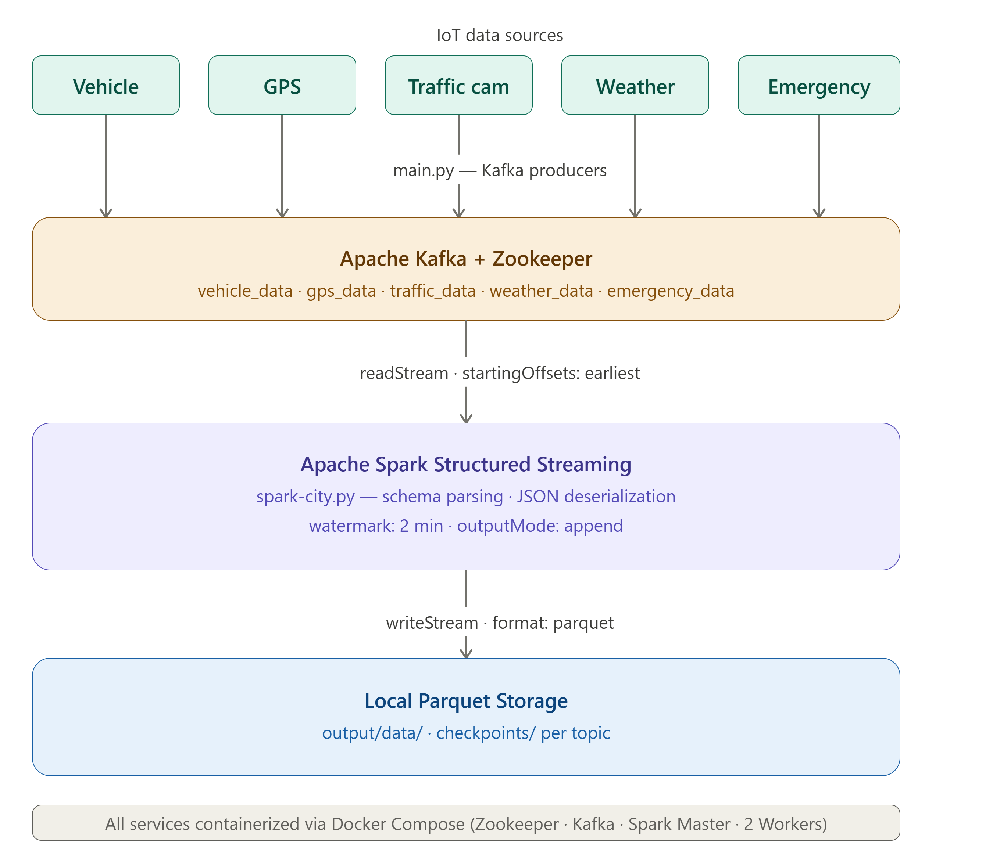

# 🏙️ Smart City — Real-Time Data Engineering Platform

<p align="center">
  
  
  
  
</p>

---

## 📌 Overview

Smart City is an end-to-end **real-time data engineering platform** that simulates and processes smart city IoT data — including vehicle movement, GPS tracking, traffic cameras, weather sensors, and emergency events.

The project demonstrates how modern cities can collect massive streaming data, process it in real time using distributed computing, and store it in a structured format ready for analytics and AI applications.

---

## 🏗️ System Architecture



**Data flow:**

```
IoT Sensors (Python simulation)
        ↓
Apache Kafka (5 topics)
        ↓
Apache Spark Structured Streaming
        ↓
Local Parquet Storage (output/)
```

---

## ⚙️ Technologies Used

| Category           | Tools                              |
|--------------------|------------------------------------|
| Language           | Python 3.10+                       |
| Data Streaming     | Apache Kafka, Apache Zookeeper     |
| Data Processing    | Apache Spark Structured Streaming  |
| Containerization   | Docker, Docker Compose             |
| Storage Format     | Apache Parquet                     |

---

## 📂 Repository Structure

```
SmartCity/
│
├── README.md
├── architecture.png
├── smartcitypresentation.pdf
│
└── SmartCity/
    ├── docker-compose.yml
    ├── requirements.txt
    ├── ERD Diagram.pdf
    └── jobs/
        ├── config.py
        ├── main.py
        └── spark-city.py
```

---

## 🔄 Data Flow Explanation

### 1. Data simulation
Smart city sensors are simulated using Python. A vehicle travels from **London → Birmingham**, generating events every 30–60 seconds:

- Vehicle information (speed, direction, make, model)
- GPS location data
- Traffic camera snapshots
- Weather readings (temperature, wind, humidity, air quality)
- Emergency alerts (accidents, fires, medical incidents)

### 2. Kafka streaming
Each data source publishes messages to a dedicated Kafka topic. Zookeeper manages the Kafka broker cluster.

| Topic | Data |
|-------|------|
| `vehicle_data` | Speed, direction, fuel type |
| `gps_data` | Coordinates, vehicle type |
| `traffic_data` | Camera ID, location, snapshot |
| `weather_data` | Temperature, wind, humidity, AQI |
| `emergency_data` | Incident type, status, description |

### 3. Spark Structured Streaming
Spark consumes real-time data from all 5 Kafka topics simultaneously. For each topic it applies a schema, deserializes JSON, sets a 2-minute watermark, and writes the results to local Parquet files with checkpointing.

---

## 🚀 How to Run

### 1. Clone the repository
```bash
git clone https://github.com/Saadawy-AI/SmartCity.git
cd SmartCity/SmartCity
```

### 2. Install Python dependencies
```bash
pip install -r requirements.txt
```

### 3. Start all services with Docker
```bash
docker-compose up -d
```

This starts: Zookeeper · Kafka broker · Spark Master · 2 Spark Workers

### 4. Run Kafka producers
```bash
python jobs/main.py
```

This simulates the vehicle journey and streams all IoT events into Kafka topics.

### 5. Run Spark Streaming job
```bash
spark-submit jobs/spark-city.py
```

Spark reads from Kafka, processes the streams, and saves Parquet files to `output/data/`.

---

## 📊 Use Cases

- 🚦 Traffic congestion monitoring
- 🛰️ Real-time vehicle tracking
- 🌦️ Weather impact analysis on road safety
- 🚨 Emergency event detection and response
- 🏙️ Smart transportation systems

---

## 🧠 Future Improvements

- Real-time dashboard (Streamlit / Power BI)
- Integration with AWS S3 or Azure Data Lake for cloud storage
- Machine learning models for traffic prediction and accident risk scoring
- Integration with AWS Athena or Azure Synapse for querying Parquet files
- Real IoT sensor integration

---

## 👤 Author

**Mohamed Saadawy**
📎 [GitHub](https://github.com/Saadawy-AI) · [LinkedIn](https://linkedin.com/in/muhammad-saadawy) · [Portfolio](https://saadawy-ai.github.io/My-Portfolio/)

---

> *This project simulates an enterprise-level smart city data platform and reflects real-world data engineering architectures used in large-scale systems.*
